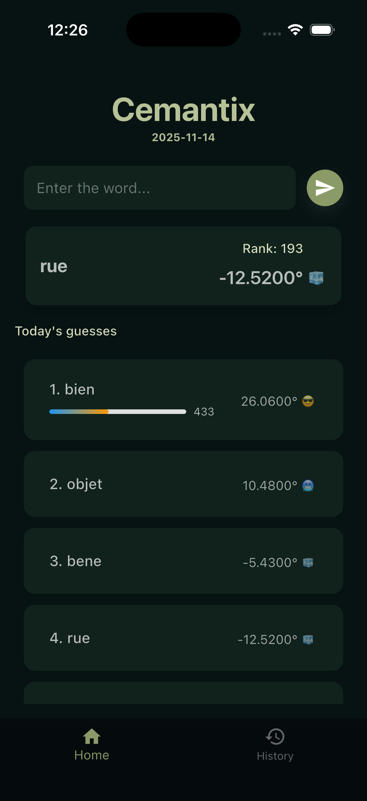
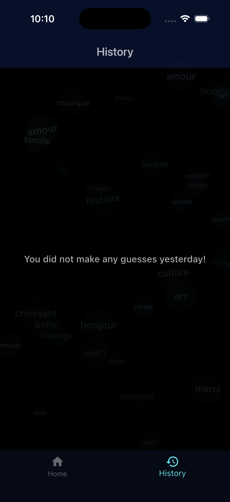
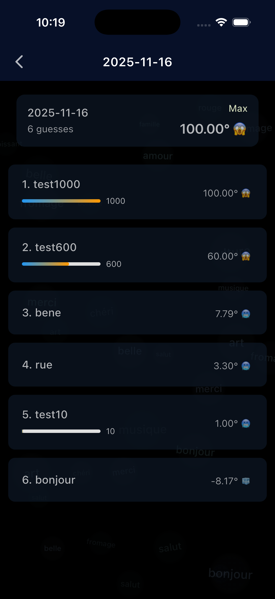

# Cemantix

## What this is

Cemantix is a small Flutter game app that practices word/meaning recognition and keeps a local history of plays. It is organized with a clear separation between UI, state management, and services so the app stays simple to understand and easy to extend.

This README gives a short overview of the design decisions, how to run the app on your machine, how to test it manually (no automated tests included yet), and a few ideas for features you might add.

## Screenshots

<p float="left">
  
  
  
</p>

## Quick architecture summary

- Flutter app (Dart) with a single entry point at `lib/main.dart`.
- State management: Provider (`lib/providers/words_provider.dart`) — lightweight, predictable, and sufficient for the app's needs.
- Models: small DTO-like models (`lib/models/word_model.dart`, `lib/models/history_model.dart`) keep data types explicit and centralized.
- Services: `lib/services/api_service.dart` and `lib/services/storage_service.dart` abstract remote/IO interactions (API and local storage). This makes the UI and providers easier to test and replace.
- UI structure:
  - Pages live under `lib/pages/` (Home, History, History Detail).
  - Reusable UI pieces (game screen, buttons, progress bar) are in `lib/widgets/`.
  - App theme configuration in `lib/theme.dart`.
- Assets and platform glue in `android/` and `ios/` folders (standard Flutter project layout).

## Why these choices

- Provider is a simple, well-supported pattern that fits the scope of the app — it keeps business logic out of widgets without adding much boilerplate.
- Separating services (API, storage) from providers reduces coupling and makes swapping implementations (for testing, or a web API vs local file cache) straightforward.
- Small, focused widgets and pages make it easy to evolve the UI without changing core logic.

## How to run the app

Requirements

- Flutter SDK (stable). Follow flutter.dev for installation steps (I used flutter version 3.35.1 and Dart 3.9.0).
- For Android: Android SDK + emulator or a physical device.
- For iOS: Xcode and a simulator or device (macOS only).
  - If you plan to run on a simulator or device from Xcode, you may need to install CocoaPods first and run:
    ```
    cd ios && pod install
    ```
    After that, return to the project root and run `flutter run` as usual.

Typical steps

1. Clone the repository and open it in your editor:
   ```
   git clone git@github.com:TasnimAnas/cemantix-game-flutter-app.git
   cd cemantix-game-flutter-app
   ```

2. Fetch packages:
   ```
   flutter pub get
   ```

3. Run on a connected device or emulator:
   ```
   flutter run
   ```
   (You can list devices with `flutter devices` and run on a specific one with `flutter run -d <deviceId>`.)

4. Build a release APK (Android):
   ```
   flutter build apk --release
   ```

Notes

- If you get analyzer/linting warnings, run `dart analyze` or use your IDE's built-in tools.
- Formatting: `dart format .` will format the repository consistently.

## How to test the app

- There are no automated tests included in the current codebase. To test manually:
  - Launch the app (see instructions above).
  - Navigate between Home and History.
  - Play the game on the "Home" screen (the game UI is in `lib/widgets/cemantix_game_screen.dart`) and verify progress and scoring behaviors.
  - Check that completed runs show up in the History page and that History Detail opens as expected.
- Suggested quick checks:
  - Start the game, produce some results, and confirm they persist across app restarts (this exercises `storage_service.dart`).
  - Toggle network (if the app relies on the API service for word data) and validate graceful handling of failures.

## Where to look in the code

- Entry point: `lib/main.dart` — app setup and bottom navigation.
- State & logic: `lib/providers/words_provider.dart`.
- Data models: `lib/models/word_model.dart`, `lib/models/history_model.dart`.
- Services: `lib/services/api_service.dart`, `lib/services/storage_service.dart`.
- Pages: `lib/pages/home_page.dart`, `lib/pages/history_page.dart`, `lib/pages/history_detail_page.dart`.
- Reusable widgets: `lib/widgets/*` (game screen, gradient button, progress bar).
- Theme: `lib/theme.dart`.

## Ideas for expanding the app

- Add user profiles with names/avatars and local leaderboards per profile.
- Cloud sync: allow users to back up/restore history via a simple backend (Firebase, Supabase, or a custom API).
- Word packs & difficulty levels: let users choose curated sets or difficulty sliders from a custom backend.
- Add a dictionary so that users can translate French to English and use the app to learn new French words!
- Support other languages, targeting a wide range of users.
- Gamify more, letting users earn points, have shareable profile links, and play in groups (fastest to solve in a group, etc)

Long-term / developer features

- Self-hosted backend
- Automated tests: unit tests for providers/services and widget tests for critical UI flows.
- CI pipeline: run `dart analyze`, `dart format --output=none`, and tests on push.
- A mini admin interface to add/remove word packs or curate content.
